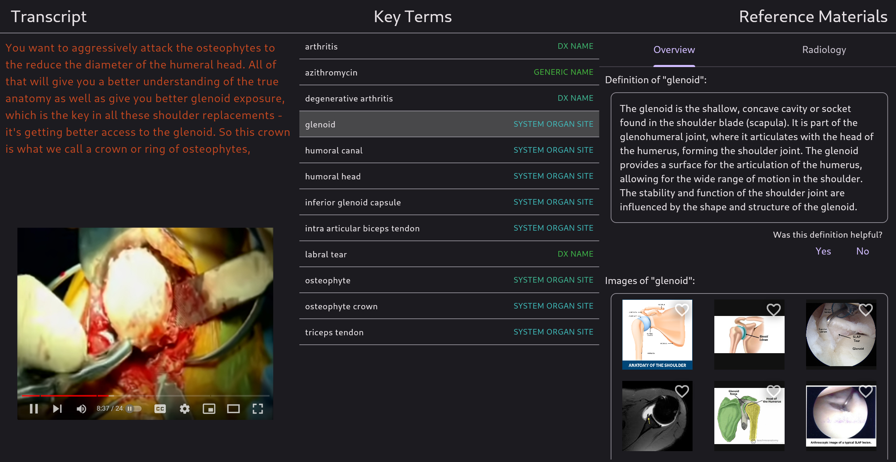

# e-Shadowing Transcriber

This is a prototype tool that transcribes an audio stream, detects the transcript's medical keywords, and automatically fetches supplementary content (definitions, pictures, drug data) when the user taps/clicks on a keyword.

It is meant to enhance the e-Shadowing experience by streamlining the process of finding good reference material without diverting one's attention away from the physician. When e-shadowing, I sometimes find myself searching Google for anatomy cartoons to refresh my memory, which is relatively cumbersome when compared to this tool.

This project serves more as an archive for an idea that I envisioned, rather than a sincere effort at producing a commercially viable product. It does exactly what I intended it to do, and I still strongly believe the concept has merit. I love medical education and seek to further our understanding of how technology may assist students and professors alike.

## Design
The application is packaged as a [Flutter](https://flutter.dev/) front-end and a [helm](https://helm.sh/) chart backend for kubernetes. The application should scale horizontally to accomodate hundreds (or even thousands) of concurrent users, without any further optimization.

### Features
- Automatic recognition of keywords
    - Diagnoses
    - Anatomy
    - Medications (both generic and brand name)
- Context-sensitive image search results
    - Images are curated for relevance
    - Anatomical cartoons & radiographs for anatomy
    - Histology images for diseases
- Automatic retrieval of drug data
    - Scrapes [DrugBank](https://go.drugbank.com/) with a [headless web browser](https://pptr.dev/)
    - Interactive 3D visualization of chemical structure
- Accurate transcription of medical language
    - Made possible with [Amazon Transcribe Medical](https://docs.aws.amazon.com/transcribe/latest/dg/transcribe-medical.html)
    - English only
- Simple and versatile architecture
    - Audio source is an [RTMP](https://en.wikipedia.org/wiki/Real-Time_Messaging_Protocol) stream
    - Developed to support [OBS](https://obsproject.com/)
    - Highly scalable [kubernetes](https://kubernetes.io/) backend

### Core technologies
- [Amazon Transcribe Medical](https://docs.aws.amazon.com/transcribe/latest/dg/transcribe-medical.html)
- [Amazon Comprehend Medical](https://docs.aws.amazon.com/comprehend-medical/)
- [Bing Web Search](https://www.microsoft.com/en-us/bing/apis/bing-web-search-api)
- [Bing Image Search](https://www.microsoft.com/en-us/bing/apis/bing-image-search-api)
- [ChatGPT](https://chat.openai.com/) (OpenAI)

### Platform support
| Platform      | Supported          |
| ------------- | ------------------ |
| Windows 10/11 | :heavy_check_mark: |
| MacOS         | :heavy_check_mark: |
| Linux         | :heavy_check_mark: |
| iOS           | :heavy_check_mark: |
| Android       | :heavy_check_mark: |
| Chrome        | :heavy_check_mark: |

## Cost Warning
Running this tool can be financially expensive. If you leave it running for an hour, don't be surprised if your AWS bill is in the hundreds of dollars. For this reason, I'm apprehensive to believe such a tool has any commercial viability at all.

## Related projects
- [Neurosurgery Video Dataset](https://github.com/thavlik/neurosurgery-video-dataset): brain & spine surgery videos curated with the intent of enhancing neurosurgical e-Shadowing. This dataset was to enrich *e-Shadowing Transcriber* by giving students the ability to click on the pixels of a live video stream to identify anatomical structures underneath the cursor.
- [thavlik portfolio](https://github.com/thavlik/machine-learning-portfolio): my showcase of medical software projects, of which this repository is a part

## License
All code in this repository is released under [MIT](LICENSE-MIT) / [Apache 2.0](LICENSE-Apache) dual license, which is extremely permissive. Please open an issue if somehow these terms are insufficient.